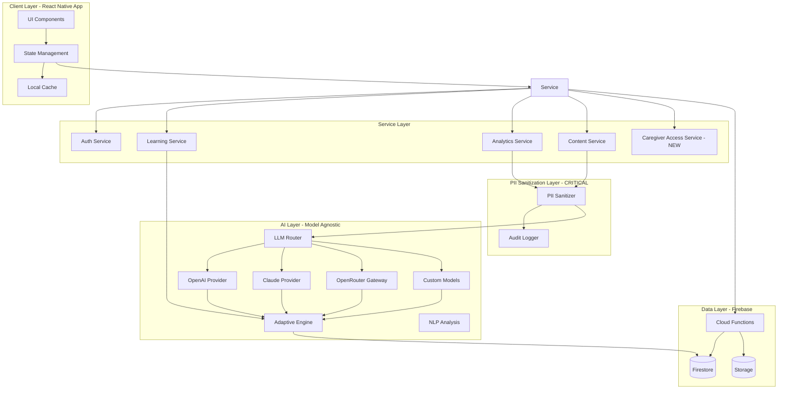

# 🏗️ Paadam Adaptive Learning - Technical Architecture

## System Overview



---

## 🤖 AI Layer Architecture - Model-Agnostic Design

### Design Philosophy

**The AI layer must be model-agnostic**: Paadam should work with OpenAI, Claude, OpenRouter, or custom models without changing agent logic. This provides:

1. **Resilience**: Auto-failover if primary provider has outages
2. **Cost Optimization**: Route simple tasks to cheaper models
3. **Quality Optimization**: Use best model for each task type
4. **Future-Proofing**: Adopt new models without code rewrites
5. **Vendor Independence**: No lock-in to single AI provider

### Architecture Layers

```
┌─────────────────────────────────────────────────────┐
│         Agent Tools (Content, Assessment, etc.)      │
└───────────────────┬─────────────────────────────────┘
                    │
                    ▼
┌─────────────────────────────────────────────────────┐
│           PII Sanitization Layer (MANDATORY)         │
│  - Strips names, locations, timestamps               │
│  - Cannot be bypassed                                │
│  - Audit logs every request                          │
└───────────────────┬─────────────────────────────────┘
                    │
                    ▼
┌─────────────────────────────────────────────────────┐
│              LLM Provider Router                     │
│  - Routing rules by tool type                       │
│  - Cost optimization                                 │
│  - Auto-failover                                     │
│  - A/B testing support                               │
└───────────────────┬─────────────────────────────────┘
                    │
        ┌───────────┼───────────┬───────────┐
        ▼           ▼           ▼           ▼
   ┌────────┐  ┌────────┐  ┌──────────┐  ┌────────┐
   │ OpenAI │  │ Claude │  │OpenRouter│  │ Custom │
   │Provider│  │Provider│  │ Gateway  │  │ Models │
   └────────┘  └────────┘  └──────────┘  └────────┘
```

### LLM Provider Interface

All providers implement a unified interface:

```typescript
interface LLMProvider {
  name: string;
  models: string[];

  // Core functionality
  async generateText(request: LLMRequest): Promise<LLMResponse>;
  async generateStructured<T>(request: StructuredLLMRequest): Promise<T>;

  // Provider info
  isAvailable(): Promise<boolean>;
  estimateCost(request: LLMRequest): number; // in cents
  getLatency(): Promise<number>; // recent average in ms

  // Rate limiting
  canHandleRequest(): boolean;
  getRateLimitStatus(): RateLimitStatus;
}

interface LLMRequest {
  prompt: string;
  systemMessage?: string;
  temperature?: number;
  maxTokens?: number;
  stopSequences?: string[];

  // Metadata
  toolName: string; // "WorksheetGenerator", "ConceptExplainer", etc.
  priority: 'low' | 'medium' | 'high'; // user-facing = high
  metadata: Record<string, any>;
}

interface LLMResponse {
  text: string;
  finishReason: 'stop' | 'length' | 'content_filter';

  usage: {
    promptTokens: number;
    completionTokens: number;
    totalTokens: number;
  };

  metadata: {
    provider: string;
    model: string;
    latencyMs: number;
    cost: number; // cents
  };
}
```

### Provider Implementations

#### OpenAI Provider

```typescript
class OpenAIProvider implements LLMProvider {
  name = "openai";
  models = ["gpt-4o", "gpt-4o-mini", "gpt-4-turbo"];

  private apiKey: string;
  private baseURL = "https://api.openai.com/v1";

  async generateText(request: LLMRequest): Promise<LLMResponse> {
    // Sanitization already done by middleware
    const response = await fetch(`${this.baseURL}/chat/completions`, {
      method: "POST",
      headers: {
        Authorization: `Bearer ${this.apiKey}`,
        "Content-Type": "application/json",
      },
      body: JSON.stringify({
        model: this.selectModel(request),
        messages: [
          { role: "system", content: request.systemMessage },
          { role: "user", content: request.prompt },
        ],
        temperature: request.temperature ?? 0.7,
        max_tokens: request.maxTokens,
      }),
    });

    const data = await response.json();

    return {
      text: data.choices[0].message.content,
      finishReason: data.choices[0].finish_reason,
      usage: {
        promptTokens: data.usage.prompt_tokens,
        completionTokens: data.usage.completion_tokens,
        totalTokens: data.usage.total_tokens,
      },
      metadata: {
        provider: "openai",
        model: data.model,
        latencyMs: Date.now() - startTime,
        cost: this.calculateCost(data.usage, data.model),
      },
    };
  }

  private selectModel(request: LLMRequest): string {
    // Simple task → gpt-4o-mini
    if (request.maxTokens && request.maxTokens < 500) {
      return "gpt-4o-mini";
    }
    // High priority or complex → gpt-4o
    return "gpt-4o";
  }

  estimateCost(request: LLMRequest): number {
    const model = this.selectModel(request);
    const estimatedTokens = this.estimateTokens(request.prompt);

    // Pricing as of 2026 (adjust as needed)
    const costs = {
      "gpt-4o": { input: 0.005, output: 0.015 }, // per 1K tokens
      "gpt-4o-mini": { input: 0.00015, output: 0.0006 },
    };

    return (estimatedTokens / 1000) * costs[model].input * 100; // return cents
  }
}
```

#### Claude Provider

```typescript
class ClaudeProvider implements LLMProvider {
  name = "claude";
  models = ["claude-3-5-sonnet-20241022", "claude-3-opus-20240229"];

  private apiKey: string;
  private baseURL = "https://api.anthropic.com/v1";

  async generateText(request: LLMRequest): Promise<LLMResponse> {
    const response = await fetch(`${this.baseURL}/messages`, {
      method: "POST",
      headers: {
        "x-api-key": this.apiKey,
        "anthropic-version": "2023-06-01",
        "Content-Type": "application/json",
      },
      body: JSON.stringify({
        model: this.selectModel(request),
        max_tokens: request.maxTokens ?? 4096,
        system: request.systemMessage,
        messages: [{ role: "user", content: request.prompt }],
        temperature: request.temperature ?? 0.7,
      }),
    });

    const data = await response.json();

    return {
      text: data.content[0].text,
      finishReason: data.stop_reason,
      usage: {
        promptTokens: data.usage.input_tokens,
        completionTokens: data.usage.output_tokens,
        totalTokens: data.usage.input_tokens + data.usage.output_tokens,
      },
      metadata: {
        provider: "claude",
        model: data.model,
        latencyMs: Date.now() - startTime,
        cost: this.calculateCost(data.usage, data.model),
      },
    };
  }

  private selectModel(request: LLMRequest): string {
    // Conversational tools → Claude Sonnet (better conversation)
    // Complex analysis → Claude Opus
    if (
      request.toolName.includes("Explainer") ||
      request.toolName.includes("Encouragement")
    ) {
      return "claude-3-5-sonnet-20241022";
    }
    return "claude-3-5-sonnet-20241022"; // default
  }
}
```

#### OpenRouter Provider

```typescript
class OpenRouterProvider implements LLMProvider {
  name = "openrouter";
  models = ["auto"]; // OpenRouter selects best model

  private apiKey: string;
  private baseURL = "https://openrouter.ai/api/v1";

  async generateText(request: LLMRequest): Promise<LLMResponse> {
    // OpenRouter uses OpenAI-compatible API
    const response = await fetch(`${this.baseURL}/chat/completions`, {
      method: "POST",
      headers: {
        Authorization: `Bearer ${this.apiKey}`,
        "HTTP-Referer": "https://paadam.app",
        "X-Title": "Paadam Learning",
        "Content-Type": "application/json",
      },
      body: JSON.stringify({
        model: "openai/gpt-4o", // or let OpenRouter auto-select
        messages: [
          { role: "system", content: request.systemMessage },
          { role: "user", content: request.prompt },
        ],
        temperature: request.temperature ?? 0.7,
      }),
    });

    const data = await response.json();

    return {
      text: data.choices[0].message.content,
      finishReason: data.choices[0].finish_reason,
      usage: data.usage,
      metadata: {
        provider: "openrouter",
        model: data.model,
        latencyMs: Date.now() - startTime,
        cost: this.calculateCost(data.usage, data.model),
      },
    };
  }
}
```

### LLM Router Service

The router decides which provider to use for each request:

```typescript
class LLMRouterService {
  private providers: Map<string, LLMProvider>;
  private routingConfig: RoutingConfig;

  constructor(config: RoutingConfig) {
    this.providers = new Map([
      ["openai", new OpenAIProvider(config.openaiKey)],
      ["claude", new ClaudeProvider(config.claudeKey)],
      ["openrouter", new OpenRouterProvider(config.openrouterKey)],
    ]);
    this.routingConfig = config;
  }

  async route(request: LLMRequest): Promise<LLMResponse> {
    // 1. Select provider based on routing rules
    const provider = this.selectProvider(request);

    // 2. Check if provider is available
    if (!(await provider.isAvailable())) {
      return this.routeWithFallback(request, provider.name);
    }

    // 3. Check rate limits
    if (!provider.canHandleRequest()) {
      return this.routeWithFallback(request, provider.name);
    }

    // 4. Execute request
    try {
      const response = await provider.generateText(request);

      // 5. Log for analytics
      await this.logUsage(request, response);

      return response;
    } catch (error) {
      console.error(`Provider ${provider.name} failed:`, error);
      return this.routeWithFallback(request, provider.name);
    }
  }

  private selectProvider(request: LLMRequest): LLMProvider {
    // Check routing rules from config
    for (const rule of this.routingConfig.rules) {
      if (this.matchesRule(request, rule)) {
        const provider = this.providers.get(rule.provider);
        if (provider) return provider;
      }
    }

    // Default: OpenAI
    return this.providers.get("openai")!;
  }

  private async routeWithFallback(
    request: LLMRequest,
    failedProvider: string,
  ): Promise<LLMResponse> {
    const fallbackChain = this.routingConfig.fallbackChain.filter(
      (p) => p !== failedProvider,
    );

    for (const providerName of fallbackChain) {
      const provider = this.providers.get(providerName);
      if (!provider) continue;

      if ((await provider.isAvailable()) && provider.canHandleRequest()) {
        try {
          console.log(`Falling back to ${providerName}`);
          return await provider.generateText(request);
        } catch (error) {
          console.error(`Fallback ${providerName} failed:`, error);
          continue;
        }
      }
    }

    throw new Error("All LLM providers failed");
  }

  private matchesRule(request: LLMRequest, rule: RoutingRule): boolean {
    // Match by tool name pattern
    if (rule.toolPattern) {
      const regex = new RegExp(rule.toolPattern);
      if (regex.test(request.toolName)) return true;
    }

    // Match by priority
    if (rule.priority && request.priority === rule.priority) {
      return true;
    }

    return false;
  }

  private async logUsage(
    request: LLMRequest,
    response: LLMResponse,
  ): Promise<void> {
    await firestore.collection("llmUsage").add({
      timestamp: new Date(),
      provider: response.metadata.provider,
      model: response.metadata.model,
      toolName: request.toolName,
      tokens: response.usage.totalTokens,
      cost: response.metadata.cost,
      latencyMs: response.metadata.latencyMs,
      priority: request.priority,
    });
  }
}

interface RoutingConfig {
  openaiKey: string;
  claudeKey: string;
  openrouterKey: string;

  rules: RoutingRule[];
  fallbackChain: string[]; // ['openai', 'claude', 'openrouter']

  costLimits?: {
    dailyMax: number; // cents
    perRequestMax: number; // cents
  };
}

interface RoutingRule {
  toolPattern?: string; // regex: ".*Generator", "Concept.*"
  priority?: "low" | "medium" | "high";
  provider: string; // 'openai', 'claude', 'openrouter'
  reason?: string; // for documentation
}
```

### Example Routing Configuration

```typescript
const routingConfig: RoutingConfig = {
  openaiKey: process.env.OPENAI_API_KEY,
  claudeKey: process.env.CLAUDE_API_KEY,
  openrouterKey: process.env.OPENROUTER_API_KEY,

  rules: [
    {
      toolPattern: ".*(Explainer|Encouragement|Question Answerer).*",
      provider: "claude",
      reason: "Claude excels at conversational, educational explanations",
    },
    {
      toolPattern: ".*(Generator|Worksheet).*",
      provider: "openai",
      reason: "GPT-4 better at structured content generation",
    },
    {
      priority: "low",
      provider: "openai", // use gpt-4o-mini for cost savings
      reason: "Low priority tasks use cheaper models",
    },
  ],

  fallbackChain: ["openai", "claude", "openrouter"],

  costLimits: {
    dailyMax: 5000, // $50/day
    perRequestMax: 50, // $0.50 per request
  },
};
```

### Usage in Agent Tools

```typescript
class WorksheetGeneratorTool {
  constructor(
    private llmRouter: LLMRouterService,
    private piiSanitizer: PIISanitizationService,
  ) {}

  async generate(input: WorksheetGeneratorInput): Promise<Worksheet> {
    // 1. Sanitize PII (MANDATORY)
    const sanitized = await this.piiSanitizer.sanitize({
      studentName: input.studentName,
      interests: input.interests,
      skillLevel: input.skillLevel,
    });

    // 2. Prepare LLM request
    const request: LLMRequest = {
      toolName: "WorksheetGenerator",
      priority: "medium",
      systemMessage: "You are an expert math educator...",
      prompt: `Generate 10 math problems for [STUDENT], grade ${sanitized.gradeLevel}...`,
      temperature: 0.7,
      maxTokens: 2000,
    };

    // 3. Router automatically selects provider
    const response = await this.llmRouter.route(request);

    // 4. Parse and return
    return this.parseWorksheet(response.text);
  }
}
```

### Benefits of This Architecture

1. **No Vendor Lock-In**: Switch providers with config change
2. **Cost Control**: Route expensive tasks to cheaper models
3. **Resilience**: Auto-failover keeps app running
4. **Quality**: Use best model for each task type
5. **Analytics**: Track cost, latency, quality per provider
6. **A/B Testing**: Compare providers for quality improvements
7. **Future-Proof**: Add new providers without code changes

---

## Core Services Architecture

### 1. Student Profile Service

**Responsibilities:**

- Manage student profiles and preferences
- Track learning progress and mastery levels
- Update XP, levels, and achievements
- Sync data across devices

**Key Methods:**

```typescript
class StudentProfileService {
  // Profile Management
  async createProfile(data: StudentProfileCreate): Promise<StudentProfile>;
  async getProfile(studentId: string): Promise<StudentProfile>;
  async updateProfile(
    studentId: string,
    updates: Partial<StudentProfile>,
  ): Promise<void>;

  // Progress Tracking
  async updateSkillMastery(
    studentId: string,
    skillId: string,
    performance: Performance,
  ): Promise<void>;
  async getSkillMastery(
    studentId: string,
    skillId: string,
  ): Promise<SkillMastery>;
  async getAllMasteryLevels(
    studentId: string,
  ): Promise<Map<string, SkillMastery>>;

  // XP & Rewards
  async addXP(
    studentId: string,
    amount: number,
    reason: string,
  ): Promise<number>;
  async checkLevelUp(studentId: string): Promise<LevelUpResult | null>;
  async awardAchievement(
    studentId: string,
    achievementId: string,
  ): Promise<void>;

  // Streaks
  async updateStreak(studentId: string): Promise<number>;
  async getStreak(studentId: string): Promise<StreakData>;

  // Learning Disposition (NEW)
  async trackPersonalityEffectiveness(
    studentId: string,
    sessionId: string,
    characterId: string,
  ): Promise<void>;
  async analyzeLearningDisposition(
    studentId: string,
  ): Promise<LearningDisposition>;
  async recommendPersonalitySwap(
    studentId: string,
  ): Promise<PersonalitySwapRecommendation | null>;

  // Guest Mode / Caregiver Access (NEW)
  async createGuestAccess(
    studentId: string,
    caregiverType: CaregiverType,
    expiresIn: number,
  ): Promise<GuestAccess>;
  async generateCaregiverBrief(
    studentId: string,
    accessCode: string,
  ): Promise<CaregiverBrief>;
  async revokeGuestAccess(guestAccessId: string): Promise<void>;

  // Right to Forget (NEW)
  async deleteSession(
    sessionId: string,
    deletedBy: string,
    reason: DeletionReason,
    deletionType: DeletionType,
  ): Promise<DeletedSession>;
  async getDeletedSessions(studentId: string): Promise<DeletedSession[]>;
}
```

### 2. Adaptive Learning Engine Service

**Responsibilities:**

- Determine appropriate difficulty for each question
- Select next question based on learning state
- Implement spaced repetition algorithm
- Detect knowledge gaps

**Key Methods:**

```typescript
class AdaptiveLearningService {
  // Question Selection
  async getNextQuestion(
    studentId: string,
    context: LearningContext,
  ): Promise<Question>;
  async selectQuestionsForSession(
    studentId: string,
    duration: number,
  ): Promise<Question[]>;

  // Difficulty Management
  async calculateDifficulty(
    studentId: string,
    skillId: string,
  ): Promise<DifficultyLevel>;
  async adjustDifficulty(
    studentId: string,
    performance: RecentPerformance,
  ): Promise<void>;

  // Learning Path
  async getRecommendedSkills(studentId: string): Promise<Skill[]>;
  async checkPrerequisites(
    studentId: string,
    skillId: string,
  ): Promise<boolean>;
  async getNextSkillInPath(studentId: string): Promise<Skill>;

  // Review & Retention
  async getReviewQueue(studentId: string): Promise<Skill[]>;
  async scheduleReview(
    studentId: string,
    skillId: string,
    performance: number,
  ): Promise<Date>;

  // Analytics
  async detectLearningGaps(studentId: string): Promise<Skill[]>;
  async analyzeMistakePatterns(studentId: string): Promise<MistakePattern[]>;
  async predictMastery(
    studentId: string,
    skillId: string,
  ): Promise<MasteryPrediction>;
}
```

### 3. Content Generation Service

**Responsibilities:**

- Generate personalized questions using AI
- Create contextually relevant problems
- Generate hints and explanations
- Adapt content to student interests

**Key Methods:**

```typescript
class ContentGenerationService {
  // Question Generation
  async generateQuestion(
    skillId: string,
    difficulty: number,
    context: StudentContext,
  ): Promise<Question>;

  async generateQuestionSet(
    skillIds: string[],
    count: number,
    studentId: string,
  ): Promise<Question[]>;

  // Personalization
  async personalizeContext(
    question: Question,
    studentProfile: StudentProfile,
  ): Promise<Question>;
  async generateWithInterests(
    skillId: string,
    interests: string[],
  ): Promise<Question>;

  // Hints & Support
  async generateHint(
    question: Question,
    attemptNumber: number,
  ): Promise<string>;
  async generateExplanation(
    question: Question,
    studentAnswer: string,
  ): Promise<Explanation>;
  async generateSimilarProblem(question: Question): Promise<Question>;

  // Analysis
  async analyzeExplanation(
    explanation: string,
    correctAnswer: string,
  ): Promise<ExplanationAnalysis>;
  async detectMisconception(
    wrongAnswer: string,
    question: Question,
  ): Promise<Misconception | null>;
}
```

### 4. Session Management Service

**Responsibilities:**

- Track learning sessions
- Record question attempts
- Calculate session metrics
- Trigger achievements

**Key Methods:**

```typescript
class SessionService {
  // Session Lifecycle
  async startSession(
    studentId: string,
    sessionType: SessionType,
  ): Promise<Session>;
  async endSession(sessionId: string): Promise<SessionSummary>;
  async pauseSession(sessionId: string): Promise<void>;
  async resumeSession(sessionId: string): Promise<Session>;

  // Question Tracking
  async recordAttempt(
    sessionId: string,
    attempt: QuestionAttempt,
  ): Promise<void>;
  async recordHintUsed(sessionId: string, questionId: string): Promise<void>;
  async recordTimeSpent(
    sessionId: string,
    questionId: string,
    seconds: number,
  ): Promise<void>;

  // Real-time Feedback
  async checkAnswer(questionId: string, answer: string): Promise<AnswerResult>;
  async getProgressiveFeedback(attempt: QuestionAttempt): Promise<Feedback>;

  // Analytics
  async getSessionStats(sessionId: string): Promise<SessionStats>;
  async detectFrustration(sessionId: string): Promise<boolean>;
  async calculateEngagement(sessionId: string): Promise<number>;
}
```

### 5. Achievement & Reward Service

**Responsibilities:**

- Track achievement progress
- Award badges and rewards
- Manage reward economy
- Trigger celebrations

**Key Methods:**

```typescript
class AchievementService {
  // Achievement Tracking
  async checkAchievements(
    studentId: string,
    event: LearningEvent,
  ): Promise<Achievement[]>;
  async awardAchievement(
    studentId: string,
    achievementId: string,
  ): Promise<AchievementUnlock>;
  async getAchievementProgress(
    studentId: string,
    achievementId: string,
  ): Promise<number>;

  // Rewards
  async awardStars(
    studentId: string,
    amount: number,
    reason: string,
  ): Promise<void>;
  async awardGems(
    studentId: string,
    amount: number,
    reason: string,
  ): Promise<void>;
  async spendCurrency(
    studentId: string,
    currencyType: Currency,
    amount: number,
  ): Promise<void>;

  // Unlockables
  async unlockItem(studentId: string, itemId: string): Promise<void>;
  async getAvailableUnlockables(studentId: string): Promise<Unlockable[]>;

  // Streaks & Daily Goals
  async checkDailyGoal(studentId: string): Promise<DailyGoalStatus>;
  async updateStreak(studentId: string, date: Date): Promise<StreakUpdate>;
}
```

### 6. Character Companion Service

**Responsibilities:**

- Manage character interactions
- Generate contextual dialogue
- Track character state and growth
- Provide emotional support

**Key Methods:**

```typescript
class CharacterCompanionService {
  // Character Management
  async getCharacter(studentId: string): Promise<Character>;
  async updateCharacterState(
    studentId: string,
    state: CharacterState,
  ): Promise<void>;
  async levelUpCharacter(studentId: string): Promise<CharacterLevelUp>;

  // Dialogue & Interaction
  async getEncouragement(context: LearningContext): Promise<string>;
  async getCelebration(achievement: Achievement): Promise<string>;
  async getHint(question: Question, difficulty: number): Promise<string>;
  async getComfort(frustrationLevel: number): Promise<string>;

  // Teaching Moments
  async generateTeachingPrompt(skill: Skill): Promise<string>;
  async evaluateTeaching(
    studentId: string,
    explanation: string,
  ): Promise<TeachingFeedback>;
}
```

---

## Data Models (TypeScript Interfaces)

### Student Profile

```typescript
interface StudentProfile {
  id: string;
  userId: string;
  name: string;
  grade: Grade;
  dateOfBirth?: Date;
  createdAt: Date;
  updatedAt: Date;

  // Progress & Gamification
  xp: number;
  level: number;
  stars: number;
  gems: number;
  currentStreak: number;
  longestStreak: number;
  totalQuestionsAttempted: number;
  totalQuestionsCorrect: number;

  // Character & Customization
  characterId: string;
  characterLevel: number;
  characterCustomization: CharacterCustomization;
  unlockedItems: string[];

  // Learning Profile
  skillMastery: Map<string, SkillMastery>;
  learningProfile: LearningProfile;
  preferences: StudentPreferences;

  // Achievements
  achievements: string[];
  badges: Badge[];
  completedQuests: string[];

  // Analytics
  lastActiveDate: Date;
  totalActiveTime: number;
  averageSessionDuration: number;
  preferredSessionTime?: string;
}

interface SkillMastery {
  skillId: string;
  masteryLevel: number; // 0-100
  lastPracticed: Date;
  totalAttempts: number;
  correctAttempts: number;
  averageTimeSeconds: number;
  needsReview: boolean;
  nextReviewDate?: Date;

  // Spaced Repetition (SM-2 Algorithm)
  easeFactor: number;
  interval: number;
  repetitions: number;
}

interface LearningProfile {
  learningVelocity: number; // How fast they master concepts (0-10)
  retentionRate: number; // How well they remember (0-1)
  persistenceScore: number; // Retry rate after mistakes (0-10)
  averageAccuracy: number; // Overall success rate (0-1)
  preferredDifficulty: DifficultyPreference;
  strongModalities: LearningModality[]; // visual, verbal, kinesthetic
  peakPerformanceTime?: TimeOfDay;
  optimalSessionLength: number; // minutes
}
```

### Skills & Curriculum

```typescript
interface Skill {
  id: string;
  name: string;
  description: string;
  category: SkillCategory; // math, logic, etc.
  subject: string; // addition, fractions, etc.
  gradeLevel: Grade;

  // Curriculum Structure
  prerequisites: string[]; // skill IDs that must be mastered first
  relatedSkills: string[]; // skills that complement this one
  nextSkills: string[]; // natural progression

  // Metadata
  difficultyRange: [number, number]; // min/max difficulty (1-10)
  estimatedMasteryTime: number; // typical minutes to master
  tags: string[];

  // Content
  conceptExplanation: string;
  examples: Example[];
  commonMisconceptions: Misconception[];
}

interface SkillCategory {
  id: string;
  name: string;
  icon: string;
  color: string;
  description: string;
  skills: string[]; // skill IDs in this category
  displayOrder: number;
}
```

### Questions & Content

```typescript
interface Question {
  id: string;
  skillId: string;
  type: QuestionType;
  difficulty: number; // 1-10

  // Content
  prompt: string;
  visualAid?: VisualAid;
  context?: string; // story/scenario context

  // Answer
  correctAnswer: string | string[]; // can have multiple correct answers
  acceptableAnswers?: string[]; // alternative valid answers
  answerFormat: AnswerFormat; // multiple-choice, numeric, text, etc.

  // Multiple Choice Options
  options?: QuestionOption[];

  // Support
  hints: Hint[];
  explanation: string;
  relatedConcepts: string[];

  // Metadata
  estimatedTime: number; // seconds
  xpValue: number;
  tags: string[];
  createdBy: "ai" | "curriculum" | "teacher";
  qualityScore?: number; // user ratings
}

type QuestionType =
  | "multiple-choice"
  | "numeric-input"
  | "show-work"
  | "explain-thinking"
  | "find-mistake"
  | "multiple-solutions"
  | "create-problem";

interface QuestionOption {
  id: string;
  text: string;
  isCorrect: boolean;
  commonMisconception?: string; // if this wrong answer reveals specific misconception
}

interface Hint {
  level: number; // 1-4, progressive difficulty
  text: string;
  type: "encouragement" | "strategy" | "example" | "step-by-step";
  revealsCost?: number; // stars cost to unlock
}
```

### Learning Sessions

```typescript
interface LearningSession {
  id: string;
  studentId: string;
  type: SessionType;
  startTime: Date;
  endTime?: Date;
  duration: number; // milliseconds
  status: "active" | "paused" | "completed" | "abandoned";

  // Content
  plannedQuestions: string[]; // question IDs
  attempts: QuestionAttempt[];

  // Performance
  questionsAttempted: number;
  questionsCorrect: number;
  averageTimePerQuestion: number;
  hintsUsed: number;

  // Rewards
  xpEarned: number;
  starsEarned: number;
  achievementsUnlocked: string[];

  // Analytics
  engagementScore: number; // 1-10
  frustrationEvents: number;
  celebrationMoments: number;
  difficultyCurve: number[]; // difficulty of each question

  // Context
  deviceInfo?: DeviceInfo;
  timeOfDay: TimeOfDay;
}

type SessionType =
  | "daily-mission"
  | "skill-practice"
  | "review"
  | "challenge"
  | "diagnostic"
  | "free-play";

interface QuestionAttempt {
  id: string;
  questionId: string;
  skillId: string;
  attemptNumber: number; // 1st attempt, 2nd attempt, etc.

  // Timing
  startTime: Date;
  submitTime: Date;
  timeSpent: number; // milliseconds

  // Answer
  studentAnswer: string;
  isCorrect: boolean;
  partialCredit?: number; // 0-1 for partially correct

  // Support Used
  hintsViewed: number[];
  showWorkData?: ShowWorkData;
  explanation?: string; // if student explained their thinking

  // Analysis
  mistakeType?: MistakeType;
  misconceptionDetected?: string;
  strategyUsed?: string;
  confidence?: number; // 1-5 self-reported
}

interface ShowWorkData {
  type: "drawing" | "steps" | "visual";
  data: any; // canvas data, step text, etc.
  aiAnalysis?: {
    strategyDetected: string;
    correctProcess: boolean;
    feedback: string;
  };
}
```

### Achievements & Rewards

```typescript
interface Achievement {
  id: string;
  name: string;
  description: string;
  category: AchievementCategory;
  tier: "bronze" | "silver" | "gold" | "platinum";

  // Requirements
  criteria: AchievementCriteria;
  prerequisites?: string[]; // achievement IDs

  // Rewards
  xpReward: number;
  starReward: number;
  gemReward?: number;
  unlocksItem?: string;

  // Display
  icon: string;
  color: string;
  celebrationAnimation: string;

  // Metadata
  rarity: number; // 1-100, how many students have this
  hidden: boolean; // surprise achievements
}

type AchievementCategory =
  | "skill-mastery"
  | "streak"
  | "milestone"
  | "learning-behavior"
  | "social"
  | "special";

interface AchievementCriteria {
  type: CriteriaType;
  target: number;
  skillId?: string;
  timeframe?: number; // days
}

type CriteriaType =
  | "questions-correct"
  | "skill-mastery-level"
  | "consecutive-correct"
  | "streak-days"
  | "perfect-session"
  | "help-character"
  | "create-problems";

interface Badge {
  achievementId: string;
  unlockedAt: Date;
  progress: number; // current progress toward next tier
  displayOnProfile: boolean;
}
```

### Character System

```typescript
interface Character {
  id: string;
  name: string;
  type: CharacterType;
  personality: CharacterPersonality;

  // Visual
  baseImage: string;
  expressionImages: Map<Emotion, string>;
  animations: Map<Action, string>;

  // Dialogue
  greetings: string[];
  encouragements: string[];
  celebrations: string[];
  hints: Map<SkillCategory, string[]>;
  comfortPhrases: string[];

  // Behavior
  responseTriggers: ResponseTrigger[];
  teachingStyle: TeachingStyle;
}

type CharacterType = "owl" | "fox" | "cat" | "pup" | "dragon";

interface CharacterPersonality {
  enthusiasm: number; // 1-10
  patience: number;
  playfulness: number;
  wisdom: number;
  traits: string[]; // "curious", "energetic", "calm", etc.
}

interface CharacterState {
  studentId: string;
  characterId: string;
  level: number;
  xp: number;

  // Customization
  customization: CharacterCustomization;

  // Relationship
  bondLevel: number; // 1-100
  lastInteraction: Date;
  favoriteMoments: string[]; // achievement IDs they celebrated together
}

interface CharacterCustomization {
  accessories: string[];
  colors: Map<string, string>;
  environment: string;
}
```

---

## Adaptive Learning Algorithm

### 1. Mastery Calculation

```typescript
function calculateMastery(
  skillId: string,
  attempts: QuestionAttempt[],
): number {
  // Weighted scoring:
  // - Recent performance weighted higher (exponential decay)
  // - Harder questions weighted more
  // - Time spent considered (too fast = guessing, too slow = struggling)
  // - Hint usage reduces score

  const recentAttempts = attempts.slice(-20); // last 20 attempts

  let totalScore = 0;
  let totalWeight = 0;

  recentAttempts.forEach((attempt, index) => {
    const recencyWeight = Math.exp(-0.1 * (recentAttempts.length - index));
    const difficultyWeight = attempt.difficulty / 10;
    const timeWeight = calculateTimeWeight(attempt);
    const hintPenalty = Math.pow(0.9, attempt.hintsViewed.length);

    const attemptScore = attempt.isCorrect ? 1 : 0;
    const weight = recencyWeight * difficultyWeight;

    totalScore += attemptScore * timeWeight * hintPenalty * weight;
    totalWeight += weight;
  });

  return (totalScore / totalWeight) * 100;
}
```

### 2. Difficulty Selection

```typescript
function selectDifficulty(
  studentProfile: StudentProfile,
  skillMastery: SkillMastery,
  recentPerformance: QuestionAttempt[],
): number {
  const baseDifficulty = masteryToDifficulty(skillMastery.masteryLevel);

  // Recent performance adjustment
  const recentAccuracy = calculateRecentAccuracy(recentPerformance);
  const performanceAdjustment = (recentAccuracy - 0.7) * 2; // target 70% success

  // Time-based adjustment
  const avgTime = calculateAverageTime(recentPerformance);
  const expectedTime = skillMastery.averageTimeSeconds;
  const timeAdjustment = avgTime < expectedTime * 0.5 ? 0.5 : 0; // too fast? increase difficulty

  // Hint usage adjustment
  const hintUsage = calculateHintUsage(recentPerformance);
  const hintAdjustment = -hintUsage * 0.3; // lots of hints? reduce difficulty

  // Learning velocity adjustment
  const velocityBonus = studentProfile.learningProfile.learningVelocity / 20;

  const finalDifficulty = Math.max(
    1,
    Math.min(
      10,
      baseDifficulty +
        performanceAdjustment +
        timeAdjustment +
        hintAdjustment +
        velocityBonus,
    ),
  );

  return Math.round(finalDifficulty * 10) / 10; // round to 1 decimal
}
```

### 3. Next Question Selection

```typescript
async function selectNextQuestion(
  studentId: string,
  context: LearningContext,
): Promise<Question> {
  const profile = await getProfile(studentId);
  const session = context.currentSession;

  // Determine question purpose
  const purpose = determineQuestionPurpose(profile, session);

  switch (purpose) {
    case "diagnostic":
      return await selectDiagnosticQuestion(profile);

    case "practice":
      return await selectPracticeQuestion(profile, session);

    case "challenge":
      return await selectChallengeQuestion(profile);

    case "review":
      return await selectReviewQuestion(profile);

    case "new-concept":
      return await selectNewConceptQuestion(profile);
  }
}

function determineQuestionPurpose(
  profile: StudentProfile,
  session: LearningSession,
): QuestionPurpose {
  const attempts = session.attempts;
  const recentAccuracy = calculateRecentAccuracy(attempts.slice(-5));

  // Need diagnostic if we're unsure about mastery level
  if (attempts.length === 0 || needsDiagnostic(profile)) {
    return "diagnostic";
  }

  // Time for spaced review?
  const reviewItems = getReviewQueue(profile);
  if (reviewItems.length > 0 && Math.random() < 0.2) {
    return "review";
  }

  // Struggling? Give more practice
  if (recentAccuracy < 0.5) {
    return "practice";
  }

  // Doing well? Offer challenge
  if (recentAccuracy > 0.85 && session.hintsUsed < 2) {
    return "challenge";
  }

  // Ready for new concept?
  if (recentAccuracy > 0.75 && canIntroduceNewConcept(profile)) {
    return "new-concept";
  }

  return "practice";
}
```

### 4. Spaced Repetition (SM-2 Algorithm)

```typescript
function updateSpacedRepetition(
  skillMastery: SkillMastery,
  performance: number, // 0-5 quality of recall
): SkillMastery {
  let { easeFactor, interval, repetitions } = skillMastery;

  if (performance >= 3) {
    // Correct answer
    if (repetitions === 0) {
      interval = 1;
    } else if (repetitions === 1) {
      interval = 6;
    } else {
      interval = Math.round(interval * easeFactor);
    }
    repetitions++;
  } else {
    // Incorrect or difficult
    repetitions = 0;
    interval = 1;
  }

  // Update ease factor
  easeFactor =
    easeFactor + (0.1 - (5 - performance) * (0.08 + (5 - performance) * 0.02));
  easeFactor = Math.max(1.3, easeFactor);

  const nextReviewDate = new Date();
  nextReviewDate.setDate(nextReviewDate.getDate() + interval);

  return {
    ...skillMastery,
    easeFactor,
    interval,
    repetitions,
    nextReviewDate,
    needsReview: false,
  };
}
```

---

## Cloud Functions Architecture

### Firebase Cloud Functions

#### 1. Session Management

```typescript
// functions/src/sessions.ts
export const createSession = functions.https.onCall(async (data, context) => {
  const { studentId, sessionType } = data;
  // Create session, select initial questions
});

export const completeSession = functions.https.onCall(async (data, context) => {
  const { sessionId } = data;
  // Calculate final stats, award XP/stars, check achievements
});
```

#### 2. Adaptive Learning

```typescript
// functions/src/adaptive.ts
export const getNextQuestion = functions.https.onCall(async (data, context) => {
  const { studentId, sessionId } = data;
  // Run adaptive algorithm, select next question
});

export const processAnswer = functions.https.onCall(async (data, context) => {
  const { sessionId, questionId, answer } = data;
  // Check answer, update mastery, provide feedback
});
```

#### 3. Content Generation

```typescript
// functions/src/content.ts
export const generateQuestion = functions.https.onCall(
  async (data, context) => {
    const { skillId, difficulty, studentContext } = data;
    // Call Claude API to generate personalized question
  },
);

export const analyzeExplanation = functions.https.onCall(
  async (data, context) => {
    const { explanation, questionId } = data;
    // Use NLP to analyze student's explanation
  },
);
```

#### 4. Achievements & Rewards

```typescript
// functions/src/achievements.ts
export const checkAchievements = functions.firestore
  .document("sessions/{sessionId}")
  .onUpdate(async (change, context) => {
    // Triggered after session update
    // Check for newly unlocked achievements
  });

export const awardDailyReward = functions.pubsub
  .schedule("every day 00:00")
  .onRun(async (context) => {
    // Award streak bonuses, reset daily goals
  });
```

---

## Performance Optimization

### Caching Strategy

```typescript
// Local cache for frequently accessed data
const cacheConfig = {
  studentProfile: { ttl: 5 * 60 * 1000 }, // 5 minutes
  skillMastery: { ttl: 60 * 1000 }, // 1 minute
  questions: { ttl: 30 * 60 * 1000 }, // 30 minutes
  achievements: { ttl: 10 * 60 * 1000 }, // 10 minutes
};

// Prefetch next questions during current question
async function prefetchNextQuestions(sessionId: string) {
  // Predict likely next questions and cache them
}
```

### Offline Support

```typescript
// Queue actions when offline
class OfflineQueue {
  async queueAnswer(answer: QuestionAttempt) {
    // Store in AsyncStorage
    // Sync when back online
  }

  async syncWhenOnline() {
    // Batch upload queued data
    // Resolve conflicts (server wins for mastery calculations)
  }
}
```

---

## Security & Privacy

### Data Protection

- All student data encrypted at rest and in transit
- **PII Sanitization Layer**: No personally identifiable information sent to LLM providers
  - Names, locations, birthdates, contact info stripped before API calls
  - Educational context (grades, skills, performance) preserved
  - All sanitization logged for audit compliance
- Parent/guardian consent required
- COPPA and GDPR compliant
- **Right to Forget**: Parents can delete specific sessions
  - Session content permanently removed
  - Metadata preserved for audit trail
  - Mastery calculations automatically updated
- Option to export/delete all data
- **Guest Mode**: Temporary caregiver access with automatic expiration
  - QR code-based access with time limits
  - Limited permissions (no full history access)
  - Parent notified of all caregiver-supervised sessions

### PII Sanitization Process

```typescript
// Before sending data to LLM
interface PIISanitizationFlow {
  // 1. Identify PII fields
  piiFields: ["name", "email", "phone", "address", "birthdate", "school"];

  // 2. Replace with placeholders
  replacements: {
    studentName: "the student" | "they";
    parentName: "their parent" | "guardian";
    location: "[LOCATION]" | "their area";
    birthdate: "age range"; // e.g., "7-8 years old"
  };

  // 3. Preserve educational context
  preservedData: [
    "grade level",
    "skills and topics",
    "performance metrics",
    "learning patterns",
    "emotional states",
    "question content",
  ];

  // 4. Log sanitization
  auditLog: {
    timestamp: Date;
    fieldsRedacted: string[];
    toolCalled: string;
    sanitizedSuccessfully: boolean;
  };
}
```

### Access Control

```typescript
// Firestore Security Rules
rules_version = '2';
service cloud.firestore {
  match /databases/{database}/documents {
    // Students can only access their own data
    match /students/{studentId} {
      allow read, write: if request.auth.uid == resource.data.userId;
    }

    // Sessions belong to student
    match /sessions/{sessionId} {
      allow read, write: if request.auth.uid == get(/databases/$(database)/documents/sessions/$(sessionId)).data.userId;
    }
  }
}
```

---

## Monitoring & Analytics

### Key Metrics to Track

- **Performance**: API response times, crash rates
- **Engagement**: DAU, session duration, retention
- **Learning**: Avg mastery improvement, concept coverage
- **Business**: User growth, premium conversions

### Analytics Tools

- Firebase Analytics for app events
- Custom dashboards for learning analytics
- A/B testing for feature optimization
- Error tracking with Crashlytics

---

This architecture provides a scalable, maintainable foundation for building an adaptive learning app that truly grows with each child! 🚀
